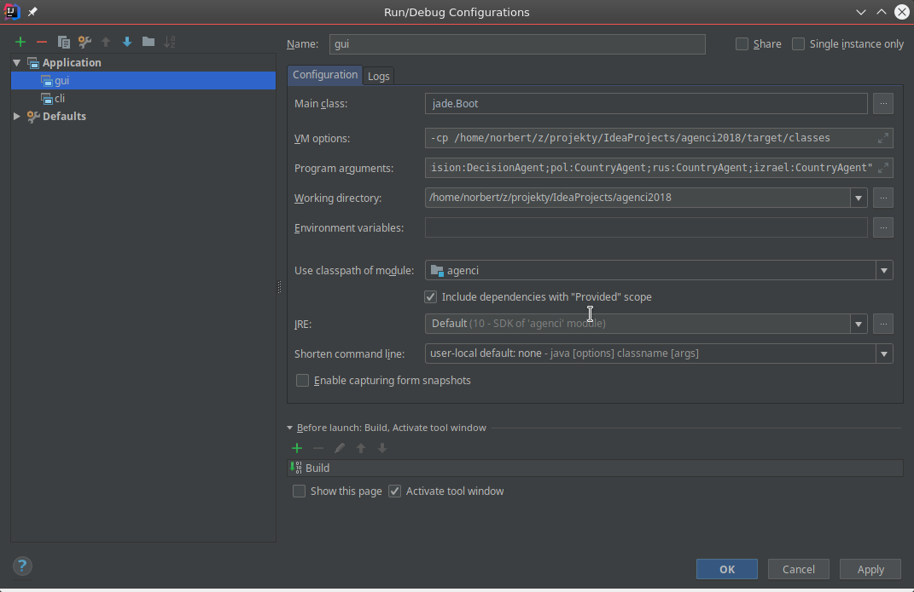
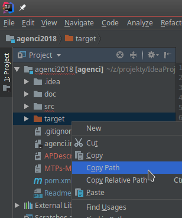

# Agenci 2018
Platforma agentowa zbudowana w oparciu o framework JADE, której zadaniem jest statystyczna analiza wiadomości prasowych i wykrywanie odstępstw od normy w częstotliwości występowania tagów (nazwy państw) w zadanym interwale.

**Technologia**
  - Java 8
  - Maven
  - [JADE 4.3](https://mvnrepository.com/artifact/net.sf.ingenias/jade/4.3) - platforma agentowa

## Konfiguracja w IntelliJ  
### JADE
Trzeba stworzyć nową konfigurację. Run->Edit configurations...
  


**Główna klasa**: jade.Boot  
**VM options**: -cp <sciezka do zbudowanych klas (prawdopodobnie folder target/classes)>  
  
**Program arguments**:  
Konfiguracja agentów dostępnych po starcie środowiska.
```$xslt
-gui -agents "decision:DecisionAgent;polska:CountryAgent"
```
Wystarczy jeden CountryAgent na początek, który później stworzy agenty dla innych krajów według potrzeb.

Apply i można normalnie odpalać zieloną strzałką albo shift-f10.

## API
### Format wiadomości
Korzystamy z klasy ACLMessage: komunikacja międzyagentowa, zgodna ze standardem [FIPA](https://en.wikipedia.org/wiki/Foundation_for_Intelligent_Physical_Agents)!
Adresem, na który wysyłane są wiadomości jest **localName** agenta. 

**senderName** *[String]* - nazwa kraju po polsku, pojedyncze kraje małymi literami, agenci odpowiadający za kilka różnych krajów - camel case.
```
    polskaUsa
    usa
    stanyzjednoczone
    polskaRosjaNiemcyKazachstan
```
**content** *[String]* - znaczenie tego pola jest zależne od typu wiadomości.  

**protocol** *[String]* - typ wysyłanej wiadomości:  
* **update** - sender: CountryAgent, receiver: CountryAgent  
    Aktualizuje bazę danych agenta na podstawie informacji przesłanych przez innego agenta.  
    **content:** ``2018:4:20:15:39:28@{polska=13, uganda=77, rosja=4}``.  
    Timestamp w formacie ``2018:4:20:15:39:28``, separator ``@``, mapa w formacie ``{polska=13, uganda=77, rosja=4}``. 
* **query** - sender: DecisionAgent, receiver CountryAgent  
    Pyta o podsumowanie częstotliwości występowania tagów w zadanym okresie.  
    **content** ``123@2018:4:20:15:39:28@2018:4:20:15:45:00``  
    Id transakcji, początek interwału, koniec interwału.  
* **query_result** - sender: CountryAgent, receiver DecisionAgent  
    Przesyła wynik zapytania na adres nadawcy.  
    **content** ``123@{polska=13, uganda=77, rosja=4}``  
    Id transakcji, wynikowa mapa.  
* **register_agent** - sender: CountryAgent, receiver DecisionAgent  
    Informuje DecisionAgenta o powstaniu nowego agenta i prosi o subskrybcję.
    **content** ``polska``
    Nazwa rejestrowanego agenta.
    
